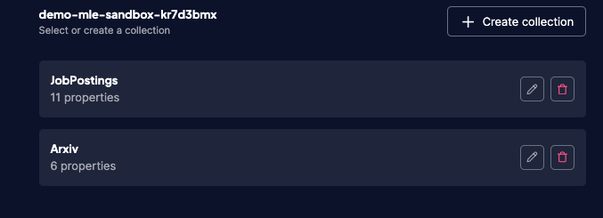

`Manan Kalra`

`Machine Learning Engineer, Genesys - Galway, Ireland`

`manankalra29@gmail.com`

`Other professional portfolio:`
- [LinkedIn](https://ie.linkedin.com/in/manankalra)
- [AI Copilots](https://www.genesys.com/en-gb/capabilities/agent-copilot)
- [RAG](https://www.genesys.com/capabilities/knowledge-management)
- [Bots](https://www.genesys.com/capabilities/voicebots)
- [Predictive Routing](https://www.genesys.com/capabilities/automated-routing)
- [Personalization / Recommendation Systems](https://www.genesys.com/capabilities/predictive-web-engagement)

<h1>1 / 2.1 Arxiv meets Weaviate</h1>

**Dataset used**: [Cornell-University/arxiv](https://www.kaggle.com/datasets/Cornell-University/arxiv)

Query: 

Generate: 

WCS Cluster: 

WCS Collections: 



**How to run**: 
```commandline
clone the repo:
---
> git clone https://github.com/manankalra/w-mle

cretae a virtualenv and install requirements:
---
> cd weaviate_1
> python3.12 -m venv venv-w-mle
> source venv-w-mle/bin/activate
> pip3 install -r requirements.txt

create .env
---
populate .env with:
- WCS_URL
- WEAVIATE_API_KEY
- AWS_ACCESS_KEY
- AWS_SECRET_KEY
- AWS_SESSION_TOKEN

run streamlit app
---
> streamlit run streamlit_app.py
```

<h1>2.2 LinkedIn Job Postings</h1>

- <h4>Instructions</h4>

  - There are `.ipynb`, `.html`, `.pdf`, and `.py` files.
  - Best way is to download the [html version](https://github.com/manankalra/w-mle/blob/main/weaviate-2.2/html%20-%20best%20looking%20and%20easy%20to%20read/2-weaviate-ml-linkedin-job-postings.html) and open it in a web browser.
    - It includes explanations, comments, decisions, interactive visualizations, and results. 
  
- <h4>Dataset</h4>

  - https://www.kaggle.com/datasets/arshkon/linkedin-job-postings
  
- <h4>Description</h4>

  - The following pipeline allows you to ask exploratory questions related to thousands of job postings that were advertised on LinkedIn in the past two years and returns a succinct response in relation to the same.

- <h4>How it works?</h4>

  - After preprocessing the data, this workflow uses **Weaviate** to create vector embeddings for the job postings.

    - Embeddings are stored in **Weaviate Cloud** for quick access at any time.
    - **Cohere**'s multilingual model is used to create embeddings. For generative tasks, Anthropic's Claude-**Sonnet** is used. 
    - Both are being accessed via **Bedrock**.
    - A collection named **JobPostings** was populated with the embeddings. The vector indices are created using **HNSW**.
    - Utility functiona are included to perform **hybrid search** either with a single query or **generative search** along with a prompt.

      - It allows the user to answer questions like:
  
        | Query | Prompt                                | Response|
        |-------|---------------------------------------|----------|
        |Machine Learning Engineer, Data Scientist, Artificial Intelligence, Applied Scientist|Which location has the most AI/ML jobs?|Based on the data provided, the location that has the most AI/ML job postings is the United States. <br/><br/>Several job postings list the location as "United States" or specific cities/regions within the United States such as <br/><br/>New York City Metropolitan Area, Sunnyvale CA, Greater Chicago Area, Waltham MA, Bentonville AR, San Jose CA, and Los Angeles CA.|
        |Healthcare, Medicine|What is the average salary for the above included jobs? Also, which is the most frequent title for jobs in this domain?|Based on the data provided, here are the answers to your questions: <br/><br/>1. The average salary range for the included jobs is difficult to calculate precisely since many of the salary listings are incomplete or show wide ranges. However, based on the available data, a rough estimate of the average salary range would be around $200,000 - $300,000 per year. <br/><br/>2. The most frequent job title in this domain, based on the data provided, is "Family Practice-Without OB Physician". This title appears 9 times across the different job listings. <br/><br/>Please note that these answers are based solely on the data you provided, and may not represent the complete picture of salaries and job titles in this domain.|
        |Healthcare, Medicine|Are there any healthcare jobs in California? If yes, which city are they based in? Are any of them based in Irvine?|Based on the data provided, there are several healthcare jobs located in California, specifically:<br/><br/>1. Telemedicine Physician - CA 100% Remote (Irvine, CA)<br/><br/>2. Internal Medicine Physician - $125/hourly - $135/hourly (San Mateo, CA)<br/><br/>3. Family Practice-Without OB Physician - $125/hourly - $135/hourly (San Mateo, CA)<br/><br/>4. Family Practice-Without OB Physician - $133/yearly (Sacramento, CA)<br/><br/>5. Family Practice-Without OB Physician - $275,000/yearly - $325,000/yearly (San Jose, CA)6. Medical Doctor (Silicon Valley, CA)<br/><br/>So yes, there are healthcare jobs listed in the data that are based in Irvine, California specifically for the role of "Telemedicine Physician - CA 100% Remote".|

- <h4>Limitations</h4>
  
  - Doesn't use any quantization techniques which could have been useful to compress the high-dimenstional embeddings.
  - Options to improve embeddgins aweren't explored. No named vectors were used as well.
  - HNSW uses the default params.
  - No multi-tenancy options are enabled for scalability.