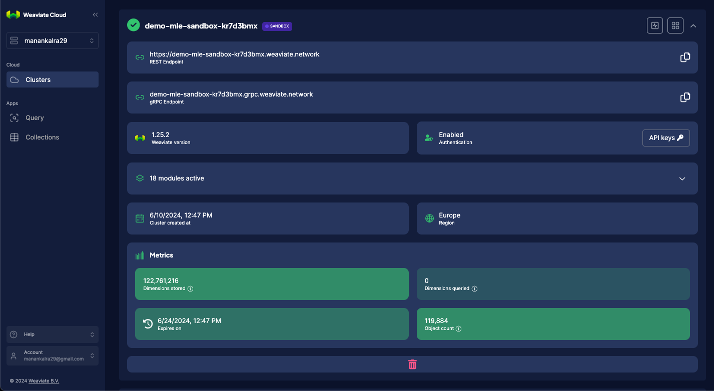

`Manan Kalra`

`Machine Learning Engineer, Genesys - Galway, Ireland`

`manankalra29@gmail.com`

`Other professional portfolio:`
- [LinkedIn](https://ie.linkedin.com/in/manankalra)
- [AI Copilots](https://www.genesys.com/en-gb/capabilities/agent-copilot)
- [RAG](https://www.genesys.com/capabilities/knowledge-management)
- [Bots](https://www.genesys.com/capabilities/voicebots)
- [Predictive Routing](https://www.genesys.com/capabilities/automated-routing)
- [Personalization / Recommendation Systems](https://www.genesys.com/capabilities/predictive-web-engagement)

<h1>1 / 2.1 Arxiv meets Weaviate</h1>

Query: 

Generate: 

WCS Cluster: 

WCS Collections: 


**How to run**: 
```commandline
clone the repo:
---
> git clone https://github.com/manankalra/w-mle

cretae a virtualenv and install requirements:
---
> cd weaviate_1
> python3.12 -m venv venv-w-mle
> source venv-w-mle/bin/activate
> pip3 install -r requirements.txt

create .env
---
populate .env with:
- WCS_URL
- WEAVIATE_API_KEY
- AWS_ACCESS_KEY
- AWS_SECRET_KEY
- AWS_SESSION_TOKEN

run streamlit app
---
> streamlit run streamlit_app.py
```